## Features
### Database
In the making of the webshop, I will need a complex database. I will need to include several models that are linked to one another. 

These models are:
* Photo
* Color
* Product
* Customer
* OrderProduct
* Order
* Favorite

#### Relationships
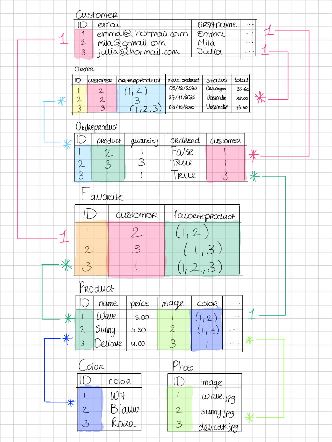

Photo has Many-to-Many relationship with Product.

Color has Many-to-Many relationship with Product.

OrderProduct has One-to-Many relationship with Product and a One-to-Many relationship with Customer.

Order has One-to-Many relationship with Customer and a Many-to-Many relationship with OrderProduct.

Favorite has One-to-One relationship with Customer and Many-to-Many relationship with Product.

## Designs
### Log in
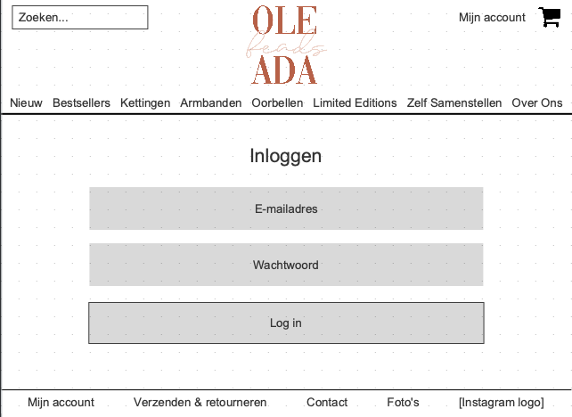

### Forgot password
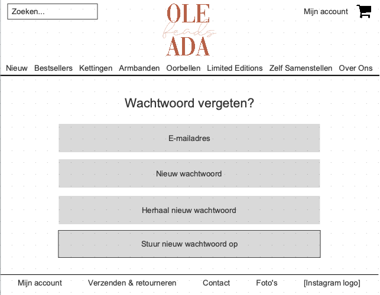

### Register
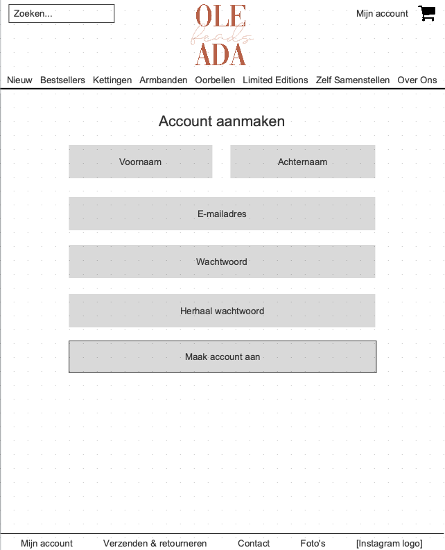

### Homepage
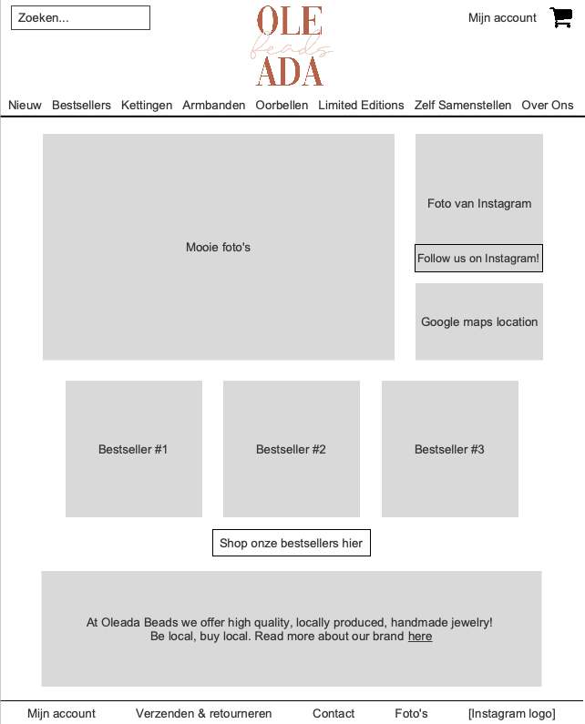

### Products
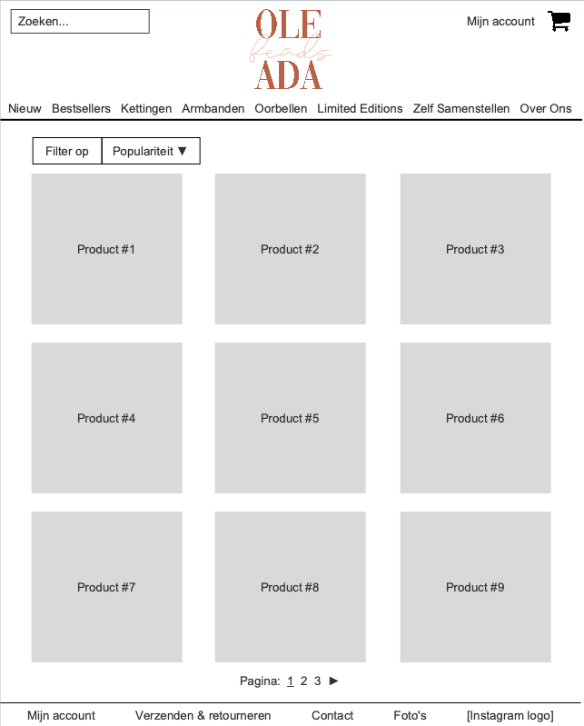

### One product
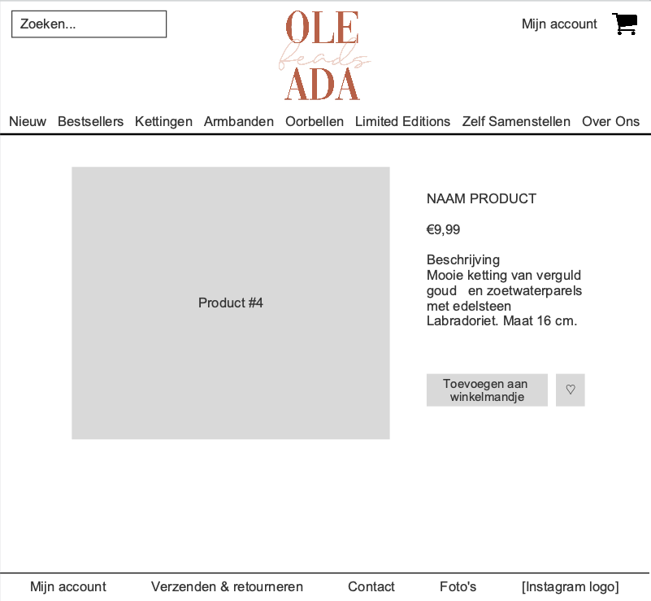

### Sold out product
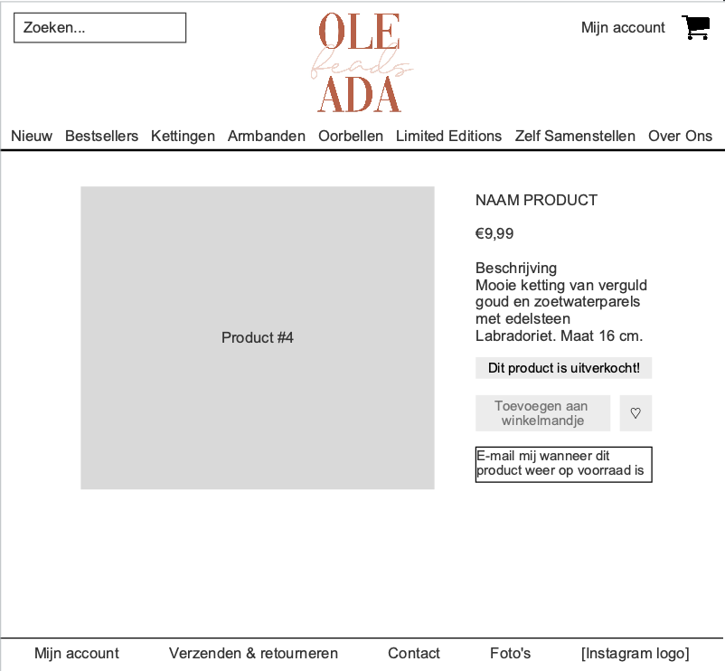

### DIY jewelry page
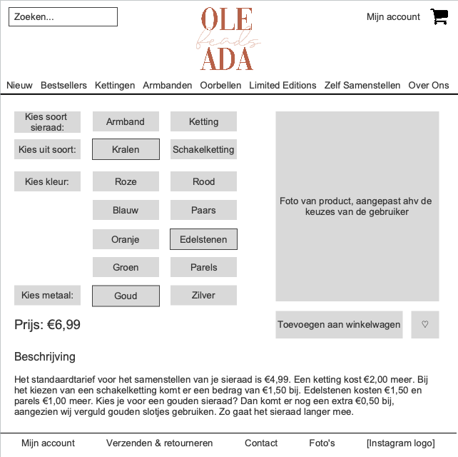

### About us

### Ordering
#### Cart summary
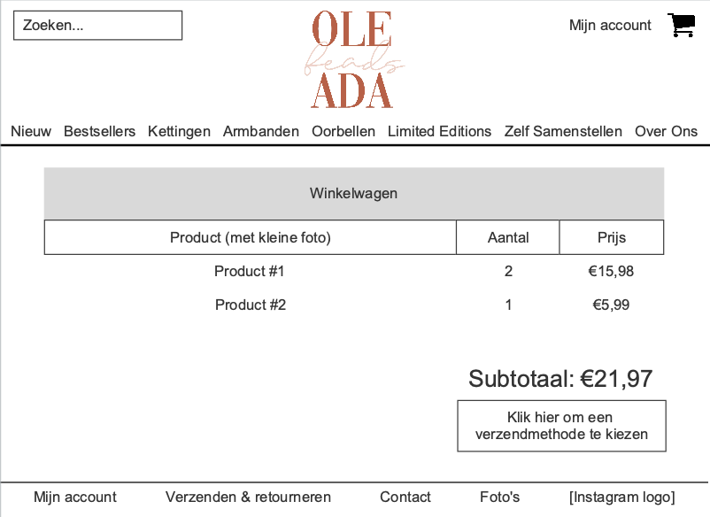

#### Log in or continue without account
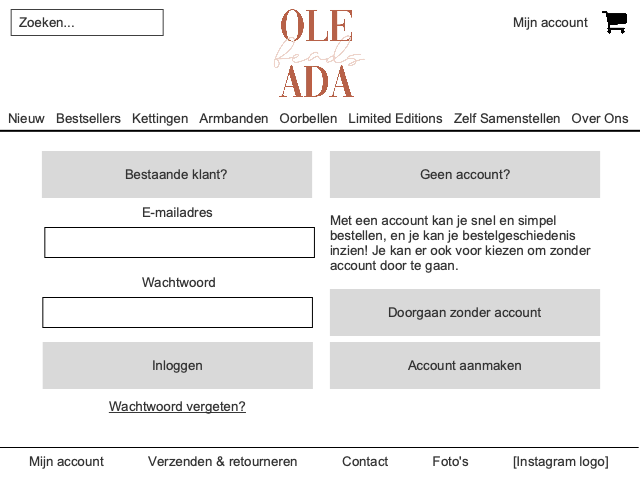

#### Checkout page
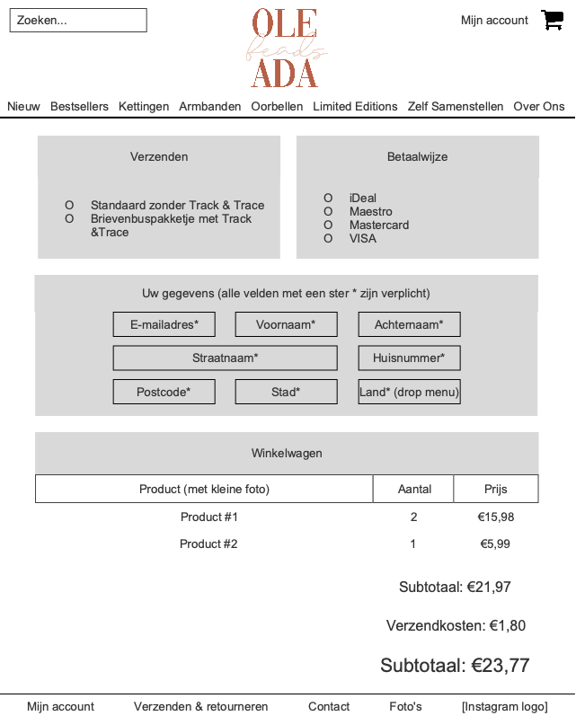

#### Order confirmation
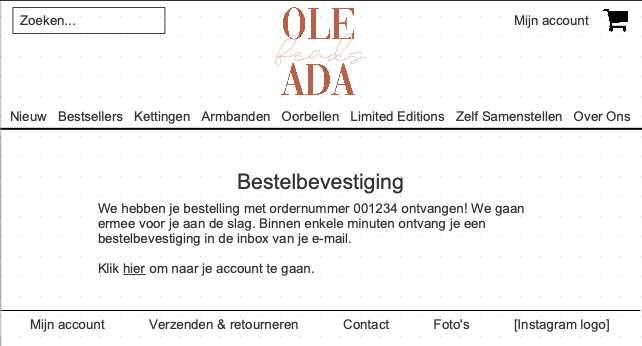

### Contact
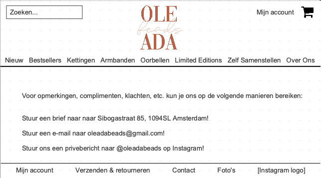

### Photos
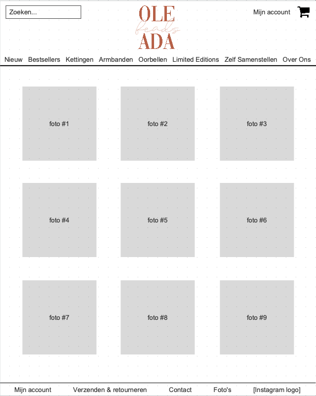

### Profile
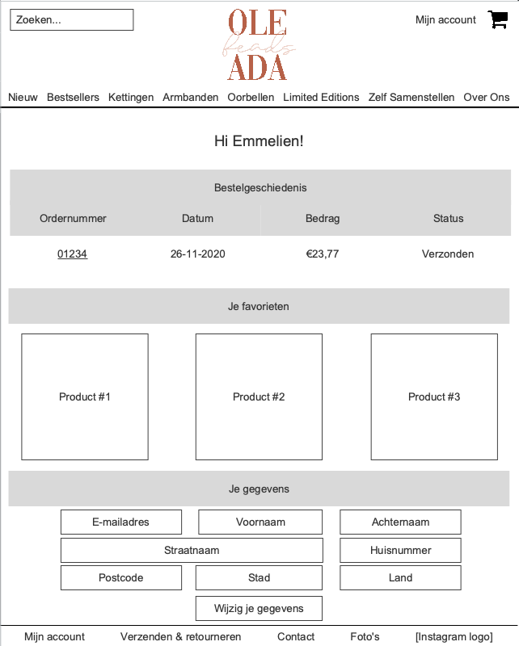

### Order info
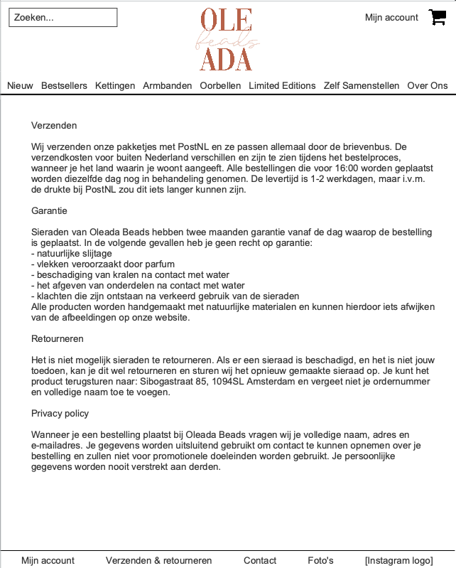
