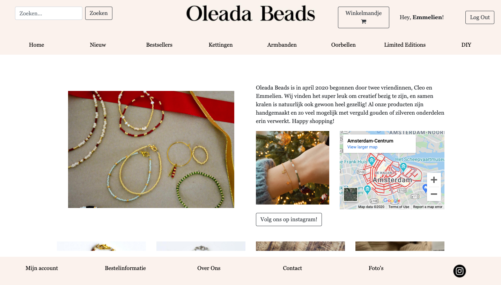
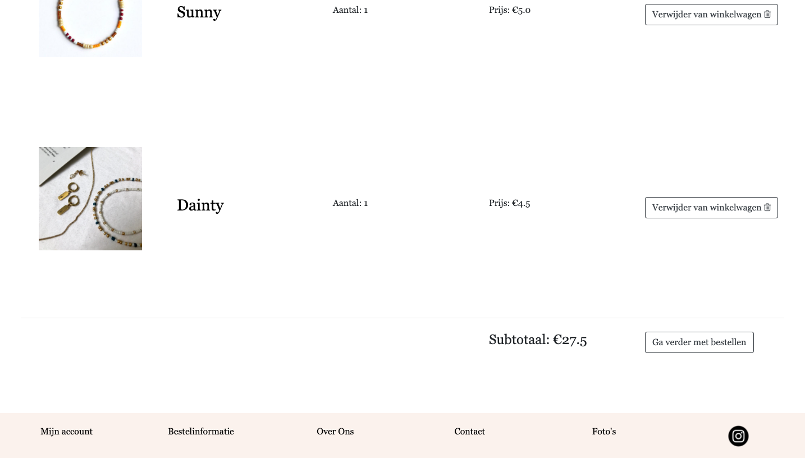

# Application Name

## OLEADA BEADS (video is in Dutch)

During the first wave of corona in the Netherlands, a friend and I decided to start a jewelry making business. We created an Instagram profile, name and logo, and we started making bracelets, necklaces, earrings -- you name it -- and we sold these items on Instagram. Because we would like to appear more professional, I have decided I want to make an online webshop for our jewelry business Oleada Beads. Maybe even after the project we will be able to launch it on the internet!

## Problem statement

Nowadays, high quality jewelry is costly. Or if you don't have the budget, you can buy low quality jewelry which is most likely to be not eco-friendly. Almost every young girl or woman wants to wear trendy and hip jewelry, but unfortunately this can be too expensive for some people. Moreover, our audience does not only consist of young girls but also mothers, grandmothers or other people who do not have an Instagram account. Almost everyone has access to the internet nowadays, so an online webshop would be the solution to this problem. People that don't have an Instagram account will still be able to buy our products.

## Solution description

In the Oleada Beads webshop, we combine these things: we offer high quality, locally produced, handmade jewelry in an online webshop. Be local, buy local. This way, young girls and women will not miss out on hip products and will still be able to afford it. By creating a dynamic, user friendly webshop the brand will provide a solution to this problem.

## Details and sketches
The webshop has a couple of pages that the user can visit. It functions as a normal webshop where one can add products to their cart and complete an order. The home page shows a snippet of what we make and what kind of products we sell. 
(doc/home.png)

### Home page
On the home page, a few bestseller products will be shown, along with a little piece about us with some pictures. Below you see a screenshot of the home page. 

On the menu, there are multiple pages the user can visit, such as "Bestsellers", "New", "Necklaces", "Earrings", "Bracelets", "Limited Editions" and "DIY". Here the user can view all products that belong to this category. If a user clicks on the page "DIY" in the menu, they will be redirected to a page where they have a couple of options to put together their own jewelry. The user provides us with their preference and we create a custom made jewelry item for this person.

The user is able to add products to their cart and is able to view the cart by clicking on the cart icon in the top right corner. If the user wants to place the order, a message will appear where the user is asked to log in if they have a login, or register if they haven't, or continue without an account. For any of the options, the webshop will render a new page, with fields that auto-fill (if that information is available) the user's name, email, address. If this information is not available the user will have to type it in manually. After placing an order, the user will recieve a confirmation email with order details. You can see below what the cart looks like. 

When a user is logged in, when they click on "My account" they will go to a page where they see a summary of their orderhistory, their favorites and their information, which they can edit. If a user has forgotten their password, they can click on "forgot password?" and they can reset their password.
